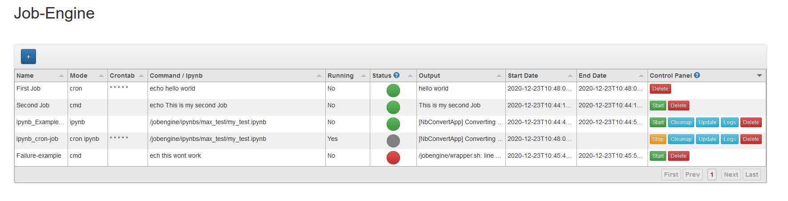
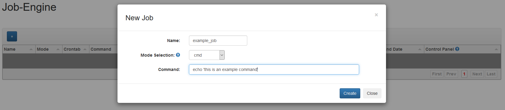
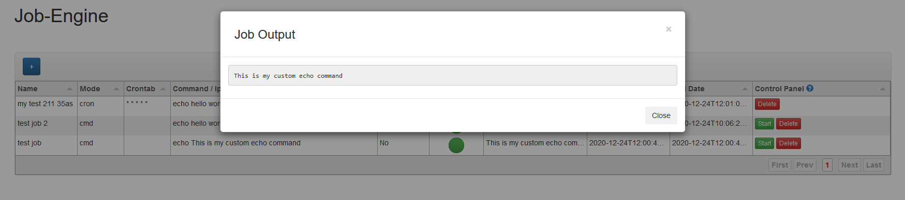

## Description

Jobengine is an open-source docker container that helps you to easily create, manage and schedule jobs.

#### Features:
- Provides a web-based User-Interface.
- Can execute shell-commands and custom scripts.
- Uses Cron to schedule jobs on the container. 
- Displays the status, output and logs of a job.
- Contains all necessary libs and packages to convert and run ipynbs.

## Quickstart

````shell script
$ docker run --name=my-jobengine -p 8010:8010 iplus1/job-engine:0.1.4
````

Additional arguments:

  |Argument|Desciption|
  |---|---|
  |``-v /your/db/directory:/jobengine/db`` | Mount a database volume to persist the database containing the jobs. Helps to preserve saved jobs.|
  |``-v /your/jupyter/directory:/jobengine/ipynbs``| Mount a volume that includes ipynbs that can be used to create jobs. The jobengine will use this directory to look for suitable ipynbs to execute.|
  |``-v /your/job/directory:/jobengine/jobs``| The Jobengine makes a job directory for every job created through the engine. Log files, the last output and the possible executed ipynb that are stored in it can be persisted by mounting a volume.|
  |``-v /path/to/pre_conditions.sh:/pre_conditions.sh``| On startup the Jobengine container checks if the pre_conditions.sh script exists and if so executes it. This gives the user the ability to perform certain tasks that have to run before the jobengine is finished starting. |
  |``-v /path/to/custom/script.sh:/jobengine/scripts/script.sh``| It is also possible to mount your own scripts into the PATH of the Jobengine container, which allows for an ease of use by just calling it as a command. The directory /jobengine/scripts is used as a PATH. |

After successfully starting the container you can access the user-interface by opening it in your browser. http://localhost:8010/ 

## UI

#### Job table:



#### Create-job menu:



#### Example job output:


